<h3><code>jkings@github ~ $ ./contributions.sh</code></h3>

  

<h3><code>jkings@github ~ $ whoami</code></h3>

<table>
  <tr>
    <td valign="top"></td>
    <td valign="top"></td>
  </tr>
</table>

 

<h3><code>jkings@github ~ $ cat contact.txt</code></h3>

  

<code>the heatmap redraws itself every morning at 06:17 UTC · everything here is generated SVG, no third-party widgets</code>

